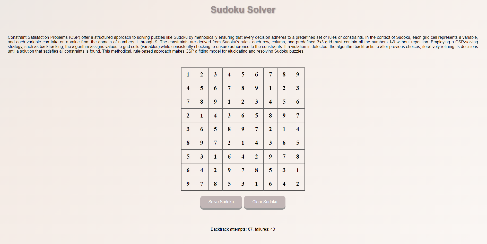

# Constraint Satisfaction Problems

<div align="center">


[](https://codecov.io/github/SverreNystad/constraint-satisfaction-problem?branch=main)


[](https://img.shields.io/badge/version-1.0.0-blue)

</div>

<details>
  <summary> <b> Table of Contents </b> </summary>
  <ol>
    <li>
    <a href="#constraint-satisfaction-problems"> Constraint Satisfaction Problems </a>
    </li>
    <li>
      <a href="#Introduction">Introduction</a>
    </li>
    </li>
    <li><a href="#Usage">Usage</a></li>
    <li><a href="#Installation">Installation</a>
      <ul>
        <li><a href="#Prerequisites">Prerequisites</a></li>
        <li><a href="#Setup">Setup</a></li>
      </ul>
    </li>
    <li><a href="#Tests">Tests</a></li>
    <li><a href="#license">License</a></li>
  </ol>
</details>

## Introduction
This is the sudoku solver. It uses CSP to solve the sudoku. The creators of this application have both never solved a sudoku, but with the power of CSP, we can solve any sudoku. Enjoy the application and have fun solving Sudokus.

The application is built with Flask and pure javascript. The CSP is implemented in python. The CSP is a backtracking algorithm. To learn more about CSP look here [CSP](https://en.wikipedia.org/wiki/Constraint_satisfaction_problem) and our [Assignment](docs/Assignment%203%20Constraint%20Satisfaction%20Problems.pdf). To implement the CSP was part of an assignment in the course TDT4136 Introduction to Artificial Intelligence at NTNU.

## Picture of the application:


## Installation
To install the Sudoku solver, one needs to have all the prerequisites installed, clone the repository, and install all dependencies. The following sections will guide you through the process.
### Prerequisites
- Ensure Python 3.9 or newer is installed on your machine. [Download Python](https://www.python.org/downloads/)
  

### Clone the repository
```bash
git clone https://github.com/SverreNystad/constraint-satisfaction-problem.git
cd constraint-satisfaction-problem
```

### Virtual Environment (Recommended)

<details> 
<summary><strong>🚀 A better way to set up repositories </strong></summary>

A virtual environment in Python is a self-contained directory that contains a Python installation for a particular version of Python, plus a number of additional packages. Using a virtual environment for your project ensures that the project's dependencies are isolated from the system-wide Python and other Python projects. This is especially useful when working on multiple projects with differing dependencies, as it prevents potential conflicts between packages and allows for easy management of requirements.

1. **To set up and use a virtual environment for Sudoku solver:**
    First, install the virtualenv package using pip. This tool helps create isolated Python environments.
    ```bash
    pip install virtualenv
    ```

2. **Create virtual environment**
    Next, create a new virtual environment in the project directory. This environment is a directory containing a complete Python environment (interpreter and other necessary files).
    ```bash
    python -m venv venv
    ```

4. **Activate virtual environment**
    To activate the environment, run the following command:
    * For windows:
        ```bash
        source ./venv/Scripts/activate
        ```

    * For Linux / MacOS:
        ```bash
        source venv/bin/activate
        ```
</details>

### Install dependencies
With the virtual environment activated, install the project dependencies:
```bash
pip install -r requirements.txt
```
The requirements.txt file contains a list of packages necessary to run Sudoku solver. Installing them in an activated virtual environment ensures they are available to the project without affecting other Python projects or system settings.


## Usage
There are two usages of this application. The first one is to use the application as a web application. The second one is to use the application as a python library.
1. To use the application as a web application, you need to run the following commands:
```bash
cd src
flask run
```

2. To use the application as a python library, you need to run the following commands:
```bash
python main.py
```

## Tests
To run all the tests, run the following command in the root directory of the project:
```bash
pytest
```

## License
Licensed under the [MIT License](LICENSE). Because this is a template repository, you need to change the license if you want to use it for your own project.


## Contributors
I would like to thank Simon Sandvik Lee, you are the best!
<table>
  <tr>
    <td align="center">
        <a href="https://github.com/SverreNystad">
            <br />
            <sub><b>Sverre Nystad</b></sub>
        </a>
    </td>
    <td align="center">
        <a href="https://github.com/sandviklee">
            <br />
            <sub><b>Simon Sandvik Lee</b></sub>
        </a>
    </td>
</table>

### Acknowledgements
We would like to thank the following people for their contributions to this project. With their work on the CSP base code, we were able to create this application.
* Original code by Håkon Måløy
* Updated by Xavier Sánchez Díaz
